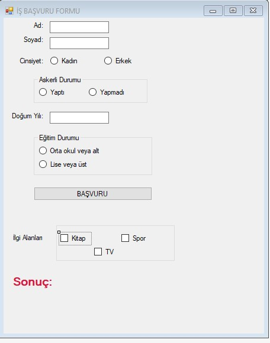

**C# Form: Radio Buton, CheckBox Uygulaması:**    

Form elemanlarının Name özellikleri şu şekilde ayarlanmıştır:      
- TextBoxlar:   
tbAd, tbSoyad, tbDogumYili
- RadioButonlar:   
rbKadin, rbErkek, rbAskerlikYapti, rbAskerlikYapmadi, rbLise, rbOrtaOkul
- Button:  
btnBasvuru   
- Label:   
lblSonuc
- CheckBox:   
cbTV, cbSpor, cbKitap


*Tasarım*   





```csharp
private void btnBasvuru_Click(object sender, EventArgs e)
{
	lblSonuc.Text = "";
	string ad, soyad;
	int yas;
	yas = 2019 - Convert.ToInt32(tbDogumYili.Text);
	ad = tbAd.Text;
	soyad = tbSoyad.Text;
	if (rbErkek.Checked == true)
	{
		if (rbAskerlikYapti.Checked == true && rbLise.Checked == true &&
			(yas >= 18 && yas < 35))
		{
			lblSonuc.Text = "Operatör kadrosuna uygun. \n";
			if(cbKitap.Checked)
				lblSonuc.Text += cbKitap.Text+" ";
			if (cbSpor.Checked)
				lblSonuc.Text += cbSpor.Text+" ";
			if (cbTV.Checked)
				lblSonuc.Text += cbTV.Text+" ";
		}
		else
			lblSonuc.Text += "Uygun iş yok.";

	}
	else
	{
		if (rbLise.Checked == true && (yas >= 18 && yas < 35))
		{
			lblSonuc.Text += "Sekreter kadrosuna uygun. \n";
			if (cbKitap.Checked)
				lblSonuc.Text += cbKitap.Text+" ";
			if (cbSpor.Checked)
				lblSonuc.Text += cbSpor.Text+" ";
			if (cbTV.Checked)
				lblSonuc.Text += cbTV.Text+" ";
		}
		else
			lblSonuc.Text += "Uygun iş yok.";
	}

}
```


