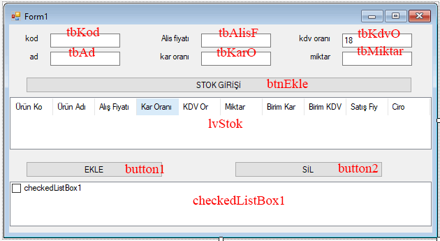

**C# Form: listView, checkedListBox Örnek Uygulaması:**    

Form elemanlarının Name özellikleri aşağıdaki resimde gösterildiği gibi ayarlanmıştır.

*Tasarım*   


```csharp
private void btnEkle_Click(object sender, EventArgs e)
        {
            int i = lvStok.Items.Count;
            lvStok.Items.Add(tbKod.Text);
            lvStok.Items[i].SubItems.Add(tbAd.Text);
            lvStok.Items[i].SubItems.Add(tbAlisF.Text);
            lvStok.Items[i].SubItems.Add(tbKarO.Text);
            lvStok.Items[i].SubItems.Add(tbKdvO.Text);
            lvStok.Items[i].SubItems.Add(tbMiktar.Text);

            double birimKar = (Convert.ToDouble(tbAlisF.Text) *
                        Convert.ToDouble(tbKarO.Text)/100);
            lvStok.Items[i].SubItems.Add(Convert.ToString(birimKar));

            double birimKDV = ((Convert.ToDouble(tbAlisF.Text)+birimKar) *
                        Convert.ToDouble(tbKdvO.Text) / 100);
            lvStok.Items[i].SubItems.Add(Convert.ToString(birimKDV));

            double satisFiyati = Convert.ToDouble(tbAlisF.Text) + birimKar + birimKDV;
            lvStok.Items[i].SubItems.Add(Convert.ToString(satisFiyati));
            double ciro = satisFiyati * Convert.ToDouble(tbMiktar.Text);
            lvStok.Items[i].SubItems.Add(Convert.ToString(ciro));
        }

        private void button1_Click(object sender, EventArgs e)
        {
            string urun = tbAd.Text + " " + tbKod.Text + " " + tbMiktar.Text;

            checkedListBox1.Items.Add(urun);
        }

        private void button2_Click(object sender, EventArgs e)
        {
            for (int i = 0; i < checkedListBox1.Items.Count; i++)
            {
                if (checkedListBox1.GetItemChecked(i))
                    checkedListBox1.Items.RemoveAt(i);
            }
        }
```


