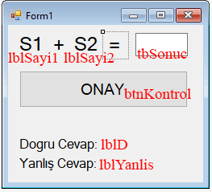

**C# Form: Random ile toplama oyunu uygulaması:**    

Form elemanlarının Name özellikleri aşağıdaki resimde gösterildiği gibi ayarlanmıştır.

*Tasarım*   


```csharp
private void Form1_Load(object sender, EventArgs e)
{
    Random rnd = new Random();
    sayi1 = rnd.Next(10);
    sayi2 = rnd.Next(10);
    lblSayi1.Text = sayi1.ToString();
    lblSayi2.Text = sayi2.ToString();

}
int d=0, y=0;
int i;
private void btnKontrol_Click(object sender, EventArgs e)
{
    if(Convert.ToUInt32(tbSonuc.Text)==(sayi1+sayi2)){
        d++;
        lblD.Text = "Doğru Cevap: " + d.ToString();
    }
    else
    {
        y++;
        lblYanlis.Text = "Yanlış Cevap: " + y.ToString();
    }
    Random rnd = new Random();
    sayi1 = rnd.Next(10);
    sayi2 = rnd.Next(10);
    lblSayi1.Text = sayi1.ToString();
    lblSayi2.Text = sayi2.ToString();

}
```