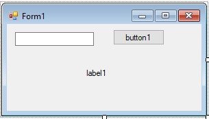

**C# Form: Timer Uygulaması:**    

Sınıfta uygulama kitapçığında olan basit uygulama gösterilmişti. Aşağıda verilen örnek biraz daha ilginç.


*Tasarım*   


```csharp
int deger = 0;
int deger1 = 0;
private void timer1_Tick(object sender, EventArgs e)
{
    if (deger > 0)
    {
        deger--;
        label1.Text = deger.ToString();
    }
    
    if (deger == 0)
    {
       
        if(deger1%2==0)
        this.BackColor = System.Drawing.Color.Red;
        else
            this.BackColor = System.Drawing.Color.Black;
        deger1++;
    }

}

private void button1_Click(object sender, EventArgs e)
{
    deger = Convert.ToInt32(textBox1.Text);
    label1.Text = deger.ToString();
    timer1.Interval = 100;
    timer1.Enabled = true;

}
```