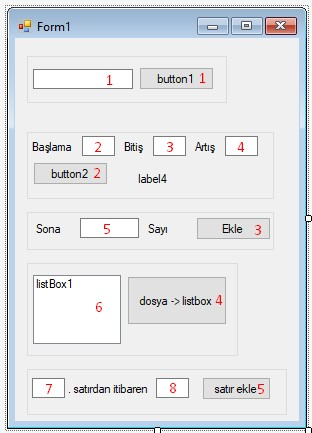

**C# Form: Dosya Okuma Yazma Uygulaması:**    

Resimde textBoxların ve Buttonların numaraları verilmiştir.   
Okuancak ve yazılacak dosyanın hangi dizinde oluşacağına dikkat edin.   
Bir fonksiyonda try-catch yapısı kullanılmıştır. Bu yapı tüm örneklerde kullanılabilir.


*Tasarım*   


```csharp
 private void button1_Click(object sender, EventArgs e)
{
	StreamWriter dosya = File.AppendText("dosya.txt");
	if (textBox1.Text == "")
	{
		dosya.WriteLine("Veri girilmedi.");
	}
	else
	{
		dosya.WriteLine("Veri: " + textBox1.Text);
	}

	dosya.Close();
}

private void button2_Click(object sender, EventArgs e)
{
	
	try
	{
		StreamWriter dosya = File.AppendText(@"D:\sayilar.txt");

		int bas, bit, art;
		label4.Text = "";
		bas = Convert.ToInt32(textBox2.Text);
		bit = Convert.ToInt32(textBox3.Text);
		art = Convert.ToInt32(textBox4.Text);
		for (int i = bas; i <= bit; i = i + art)
			dosya.WriteLine(i.ToString());
		label4.Text = "Yazıldı.";
		dosya.Close();
	}
	catch
	{
		MessageBox.Show("Hata!");
	}
	
}

private void button3_Click(object sender, EventArgs e)
{
	string[] satirlar = File.ReadAllLines(@"D:\sayilar.txt");

	int uzunluk;
	uzunluk = satirlar.Length;

	int son_sayi = Convert.ToInt32(satirlar[uzunluk - 1]);

	StreamWriter dosya = File.AppendText(@"D:\sayilar.txt");

	int ekleme_sayisi = Convert.ToInt32(textBox5.Text);

	for (int i = son_sayi; i < son_sayi + ekleme_sayisi; i++)
		dosya.WriteLine(i.ToString());

	dosya.Close();

}

private void button4_Click(object sender, EventArgs e)
{
	StreamReader dosya = new StreamReader(@"D:\sayilar.txt");
	string satir;
	while ((satir = dosya.ReadLine()) != null)
	{
		listBox1.Items.Add(satir);
	}
	dosya.Close();
}

private void button5_Click(object sender, EventArgs e)
{
	int satir = Convert.ToInt32(textBox6.Text);
	int ekle = Convert.ToInt32(textBox7.Text);
	string[] satirlar = File.ReadAllLines(@"D:\sayilar.txt");
	StreamWriter dosya = File.AppendText(@"D:\sayilar1.txt");


	for (int i = 0; i < satir; i++)
		dosya.WriteLine(satirlar[i]);

	int baslama_sayi = Convert.ToInt32(satirlar[satir]);

	for (int i = baslama_sayi; i < baslama_sayi + ekle; i++)
		dosya.WriteLine(i.ToString());

	for (int i = satir + 1; i < satirlar.Length; i++)
		dosya.WriteLine(satirlar[i]);

	dosya.Close();
}
```